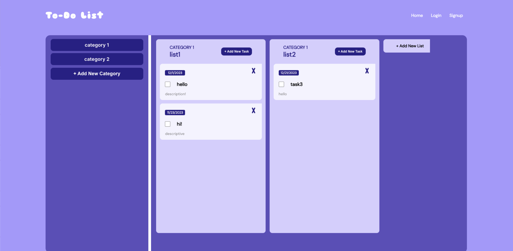
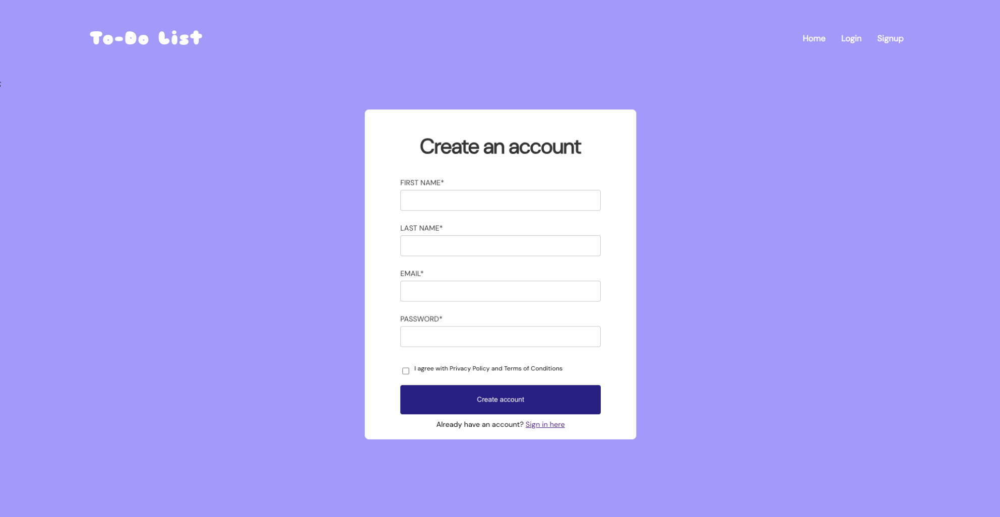

# To Do List Application

**Collaborators:** Monica Min (@monicamin17), Adam Raslan (@araslan1), Hong Wang (@hongwang260), Anthony Xu (@anthonyx24), Kevin Yang (@MadkevOP7), Allison Yi (@allisondyi), Kathy Lin

**Links:**
- [Original Frontend Repo](https://github.com/araslan1/todolist_frontend)
- [Original Backend Repo](https://github.com/MadkevOP7/todo-list-201)
- [Demo](https://drive.google.com/file/d/1_ejMvJmuZauNhYJl81uX-RkpfDAiTjgh/view?usp=drive_link)
- [Presentation](https://docs.google.com/presentation/d/16eHyctEIXa0EIGafTbUcmk0sYq9XZ-NscPqY5N48JME/edit?usp=sharing)
- [Documentation](https://docs.google.com/document/d/1I9ADkrydDhnRukxCcmBfpsY2VeCbdb3x3__NV_CBakA/edit?usp=drive_link)

**Description:** This is a consolidated showcase repository of the class project I was part of, where we built a to-do-list web application. The app supports authenticated and guest user functionality, with authenticated users able to store their to-do-lists remotely.

**Practices:** Object Oriented Programming, Multithreading, Networking, Cloud Storage, User Authentication 

**Tech Stack:** React.js frontend, Java backend (built with Maven, hosted on Tomcat server), Firestore database

